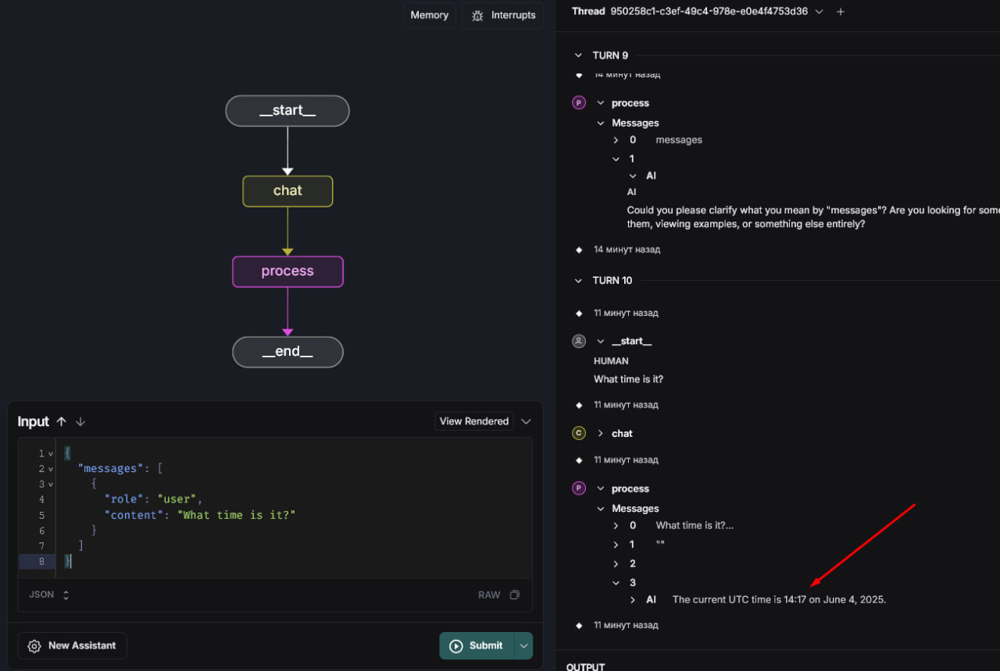

# LangGraph Stateless Chat Bot

A simple stateless chat bot built with LangGraph that responds to user messages and uses a `get_current_time` tool to provide the current UTC time in ISO-8601 format when requested (e.g., `{"utc": "2025-06-04T14:57:00+00:00"}`).

## Setup

1. **Clone the Repository**:
   ```bash
   git clone <your_repo>
   cd <your_repo>
   ```

2. **Create and Activate a Virtual Environment**:
   ```bash
   python -m venv .venv
   source .venv/bin/activate  # On Windows: .venv\Scripts\activate
   ```

3. **Install Dependencies**:
   ```bash
   pip install -r requirements.txt
   ```

4. **Set API Keys**:
   - Create a `.env` file (use `.env.example` as a template):
     ```plaintext
     OPENAI_API_KEY=your-openai-key
     LANGCHAIN_API_KEY=your-langsmith-key
     ```
   - Or set manually:
     ```bash
     export OPENAI_API_KEY='your-openai-key'
     export LANGCHAIN_API_KEY='your-langsmith-key'
     ```
   - Note: `LANGCHAIN_API_KEY` is required for LangGraph Studio. If not provided, you can still test via `python main.py` or `client.py`.

5. **Run the Application**:
   - **Console Mode**:
     ```bash
     python main.py
     ```
     - Type messages like "What time is it?" to get the current UTC time.
     - Type "exit" or "quit" to stop.
   - **Server Mode with `langgraph dev`**:
     ```bash
     langgraph dev
     ```
     - Access LangGraph Studio at `https://smith.langchain.com/studio/?baseUrl=http://127.0.0.1:2024`.
     - Input example:
       ```json
       {
         "messages": [
           {
             "role": "user",
             "content": "What time is it?"
           }
         ]
       }
       ```
     - Alternatively, interact via WebSocket using `client.py` (optional):
       ```bash
       python client.py
       ```
       - Note: `client.py` is an additional script for testing via WebSocket and is not required for the task.




## Usage

- In console mode (`python main.py`), interact directly in the terminal.
- In server mode (`langgraph dev`), use LangGraph Studio or `client.py` to send requests.
- Example input: "What time is it?"
- Expected output: "The current UTC time is 2025-06-04T14:57:00+00:00." (time will vary).

## Requirements

- Python 3.8+
- OpenAI API key with sufficient credits
- LangSmith API key (optional for Studio)
- Dependencies listed in `requirements.txt`

## Notes

- The bot uses the `gpt-4o` model via OpenAI.
- Ensure the OpenAI API key has sufficient credits.
- If running on WSL, you may see a `gio` error when `langgraph dev` tries to open the browser. Ignore it and open the Studio URL manually.
- Screenshots of the working application (via `python main.py` and Studio) are available in the `screenshots` folder.
